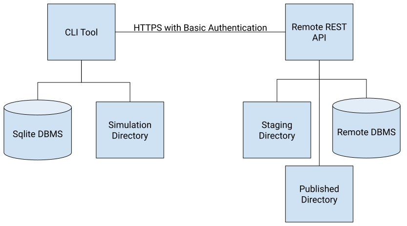

# Architecture

SimDB is a command line client plus an optional shared server. This page
describes how the pieces fit together and how data moves between them. For the
user-facing concepts (simulation, manifest, metadata, and so on), see
[Concepts](concepts.md).

## Two components

SimDB has two major components: one local to the user and one remote.

- The **local component** is a command line tool, similar in spirit to tools
  like `git`. Commands are organised as a tree, each level with its own
  `--help`.
- The **remote component** manages the shared reference database and its
  metadata.

The two communicate through a REST API over SSL-encrypted HTTP. Interactions are
stateless, do not assume a permanent connection, are keyed on a simulation's
UUID, and require authentication on each request. See the
[REST API reference](../reference/rest-api.md).

## Component overview

1. **CLI tool**: manages simulation metadata, the file manifest, and
   provenance, and lets the user query these locally and on remotes.
2. **Local SQLite database**: stores the user's ingested simulations before
   they are pushed to a remote.
3. **Simulation directory**: where a simulation was run and where its files are
   read from when pushing.
4. **Remote REST API**: receives pushed simulations and stores them for
   validation and publishing.
5. **Staging directory**: where pushed files are placed while awaiting
   validation, named by the simulation UUID, then moved to permanent storage
   once committed.
6. **Remote database**: stores metadata, provenance, and validation status for
   every uploaded simulation (PostgreSQL in production, optionally SQLite).

## Supported platforms

SimDB runs on Linux, macOS, and Windows.

## Data flow

### Ingest

The user writes a [manifest](../reference/manifest-format.md) and runs
`simdb simulation ingest`. SimDB resolves each input and output URI, computes
checksums, and records the simulation and its files in the local SQLite
catalogue.

### Push

`simdb simulation push` transfers the simulation to a server. The metadata is
sent as a structured payload, and each referenced file is streamed over HTTP
(compressed in transit). For IMAS URIs, SimDB discovers the underlying files
from the backend; local IMAS URIs are rewritten to remote URIs using the
server's `imas_remote_host`/`imas_remote_port` settings so the data stays
reachable. Files land in the staging directory, are checksummed, validated, and
then committed to permanent storage.

### Pull

`simdb simulation pull` is the mirror of push: it copies a simulation's metadata
from the server into the local catalogue and downloads its data files into a
directory you choose.

## Server stack

In production the server runs as a WSGI application (the `simdb_server` entry
point) behind a dedicated web server such as Nginx, with Gunicorn as the WSGI
server, and PostgreSQL as the database. The schema is managed with
[Alembic](https://alembic.sqlalchemy.org/) migrations. See
[Operating a server](../how-to/operate-server/install-server.md).

## Validation

The server can validate simulations on upload: integrity checks confirm that
file checksums still match, metadata is checked against a
[Cerberus](https://docs.python-cerberus.org/) schema, and file contents can be
checked by a file validator such as the IDS validator. See
[Validation](validation.md).
